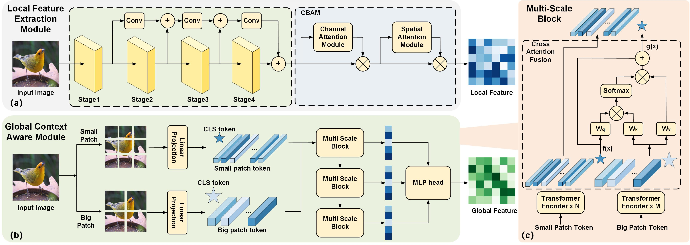

# MGL-IQA

 code for paper "Meta-learning Enhanced Global-Local Feature Fusion for Image Quality Assessment" 

 

 ## Dependencies
 - Python
 - Pytorch

## Code
- [X] Meta-Training
- [X] Finetune
- [ ] optimizing

## Acknowledgement
We extend our heartfelt thanks to the developers of the following open-source projects:
- [Cross-ViT](https://arxiv.org/pdf/2103.14899)
- [EfficientNet](https://arxiv.org/pdf/1905.11946)

Their contributions have been invaluable to the development of our project. We deeply appreciate their efforts and support.
