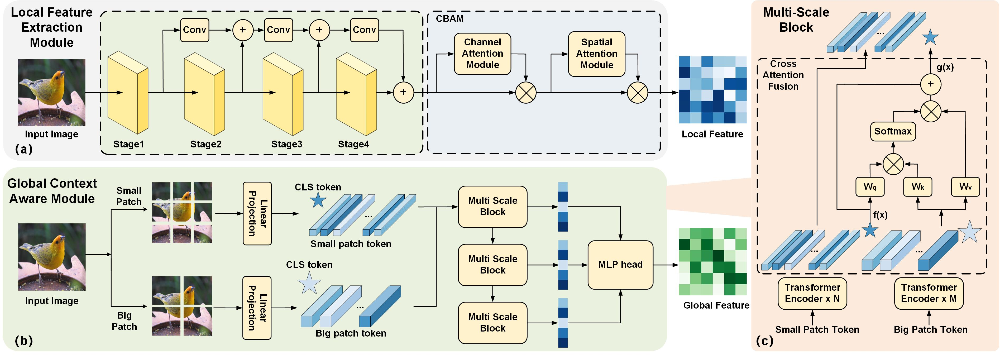

# MGL-IQA

 code for paper "Meta-learning Enhanced Global-Local Feature Fusion for Image Quality Assessment" 

 
---

 ## Dependencies
 - Python
 - Pytorch
 - timm==0.4.12
---

## Steps
### 1. Meta-training
*Modify dataset path*

'''bash
python MGLIQA_meta_training.py
'''
### 2. Finetune
'''bash
python MGLIQA_finetune.py
'''
---
## Code
- [X] Meta-Training
- [X] Finetune
- [ ] Optimizing
---

## Acknowledgement
We extend our heartfelt thanks to the developers of the following open-source projects:
- [Cross-ViT](https://arxiv.org/pdf/2103.14899)
- [EfficientNet](https://arxiv.org/pdf/1905.11946)
- [MetaIQA](https://arxiv.org/abs/2004.05508)

Their contributions have been invaluable to the development of our project. We deeply appreciate their efforts and support.
